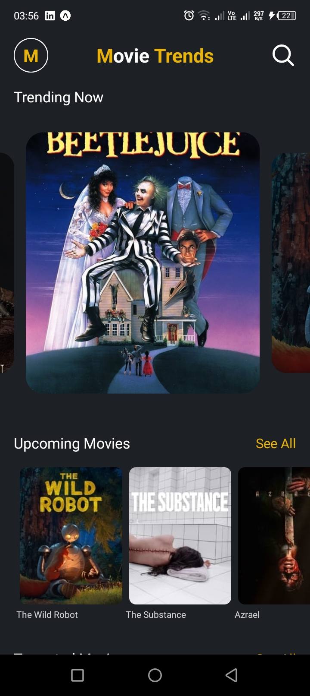
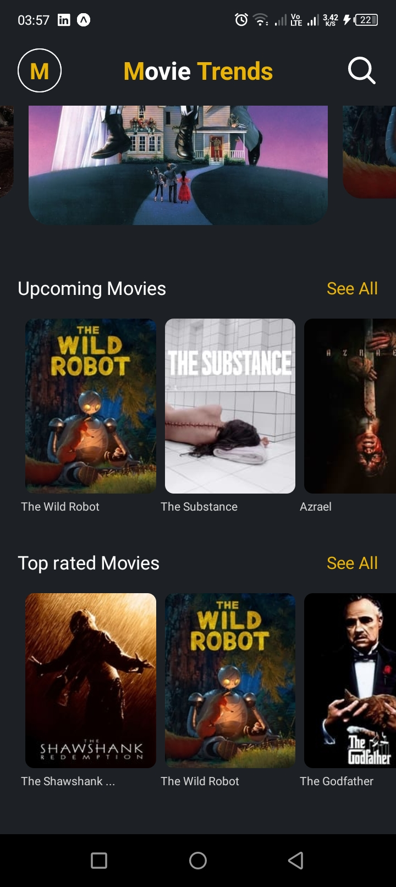
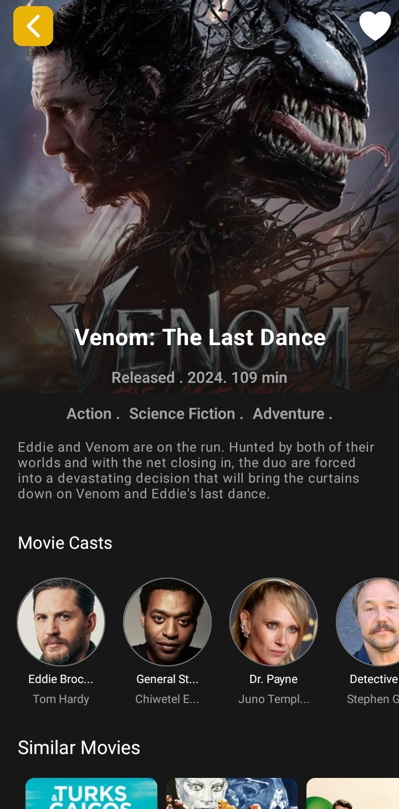
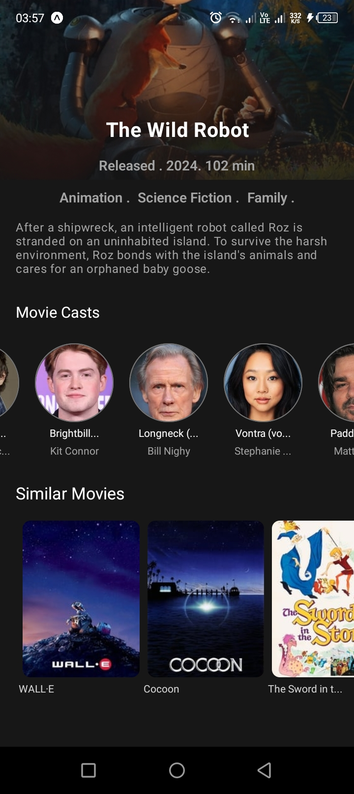
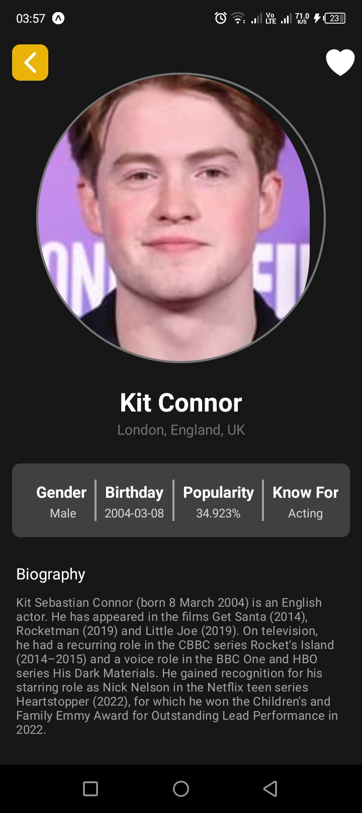

# [Movie Trends][link]

<div style={{ textAlign: "center" }}>

  
</div>


> <div style={{ margin: 20, maxWidth: 700, lineHeight: "1.6" }}>
  The Movie Trends app is a user-friendly platform designed to help movie enthusiasts discover trending movies with ease. Built with Expo, the app allows users to search for movies, view detailed information, and explore the cast involved in each production. With a smooth and intuitive interface, users can stay updated with the latest movies in real time.
</div>

## `Get Application`

<div style={{ display: "flex",  gap: "20px" }}>
  <a href="#" target="_blank" rel="noopener noreferrer">
    
  </a>
  <a href="#" target="_blank" rel="noopener noreferrer">
    
  </a>
</div>


### `screenshots`

<div style={{ textAlign: "center", display: 'flex', gap: 8, flexWrap: 'wrap', justifyContent: 'center', width: "100%", margin: "auto" }}>
<div style={{ textAlign: "center" }}>
  
</div>
<div style={{ textAlign: "center" }}>
  
</div>
<div style={{ textAlign: "center" }}>
  
</div>
<div style={{ textAlign: "center" }}>
  
</div>
<div style={{ textAlign: "center" }}>
  
</div>
<div style={{ textAlign: "center" }}>
  
</div>
</div>


## `Features`

- Trending Movies: Displays a list of the most popular and trending movies.

- Movie Search: Allows users to search for specific movies by title.
- Movie Details: Provides detailed information for each movie, including synopsis, genre, release date, and ratings.
-Cast Information: Displays the main cast and crew of each movie, with biographies and roles.
-Real-time Updates: Automatically updates with the latest trending movies.
- Responsive Design: Works seamlessly across different screen sizes, ensuring a great user experience on both mobile and tablets.
- Fast and Lightweight: Optimized performance to deliver quick results, even on slower connections.

## `Tech`

- React Native 
- Expo
- JavaScript
- TypeScript
- Nativewindcss / Tailwindcss


## `Get started`

1. Install dependencies

   ```bash
   npm install
   ```

2. Start the app

   ```bash
    npx expo start
   ```

In the output, you'll find options to open the app in a

- [development build](https://docs.expo.dev/develop/development-builds/introduction/)
- [Android emulator](https://docs.expo.dev/workflow/android-studio-emulator/)
- [iOS simulator](https://docs.expo.dev/workflow/ios-simulator/)
- [Expo Go](https://expo.dev/go), a limited sandbox for trying out app development with Expo

You can start developing by editing the files inside the **app** directory. This project uses [file-based routing](https://docs.expo.dev/router/introduction).

## Get a fresh project

When you're ready, run:

```bash
npm run reset-project
```

This command will move the starter code to the **app-example** directory and create a blank **app** directory where you can start developing.

## Learn more

To learn more about developing your project with Expo, look at the following resources:

- [Expo documentation](https://docs.expo.dev/): Learn fundamentals, or go into advanced topics with our [guides](https://docs.expo.dev/guides).
- [Learn Expo tutorial](https://docs.expo.dev/tutorial/introduction/): Follow a step-by-step tutorial where you'll create a project that runs on Android, iOS, and the web.


<!-- links  -->
[link]: <https://github.com/nyambogahezron>

